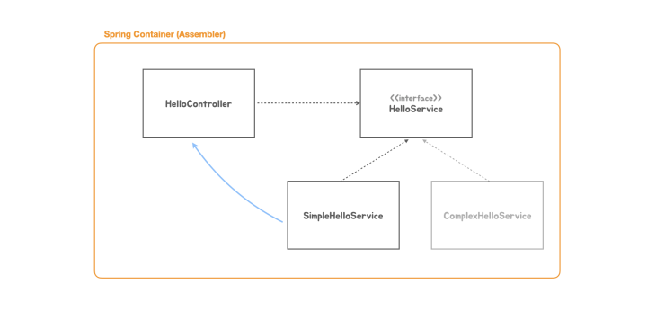

# toby-springboot


## 1. Hello 컨트롤러
초기 프로젝트 생성 및 Hello 컨트롤러 생성

## 독릭 실행형 서블릿 애플리케이션
### Embedded Tomcat 생성 및 Servlet 등록
* 스프링 부트를 만들 때 web 모듈을 선택하면 내장형 톰캣 라이브러리가 추가됨. 해당라이브러리를 이용해 컨테이너 start

```
ServletWebServerFactory serverFactory = new TomcatServletWebServerFactory();
WebServer webServer = serverFactory.getWebServer();
webServer.start();
```

* ServletContextInitializer 를 사용해 서블릿 등록
```
@FunctionalInterface
public interface ServletContextInitializer {
void onStartup(ServletContext servletContext) throws ServletException;

servletContext.addServlet("hello", new HttpServlet() {
    @Override
    protected void service(HttpServletRequest req, HttpServletResponse resp) throws ServletException, IOException {
        ...
    }
}).addMapping("/hello");
```


### 프론트 컨트롤러
프론트 컨트롤러가 요청 분석 -> 구분 한뒤에 이를 처리할 핸들러로 요청 전달 돌려준 리턴 값을 해석해 요청 생성
```
if (req.getRequestURI().equals("/hello") && req.getMethod().equals(HttpMethod.GET.name())) {
    String name = req.getParameter("name");
    String ret = helloController.hello(name);
    resp.setStatus(HttpStatus.OK.value());
    resp.setHeader(HttpHeaders.CONTENT_TYPE, MediaType.TEXT_PLAIN_VALUE);
    resp.getWriter().println(ret);
}
```


## 독립 실행형 스프링 애플리케이션
코드로 스프링 컨테이너를 만드는 가장 간단한방법은 ApplicationContext 를 구현한 GenericApplicationContext를 이용

```
GenericApplicationContext applicationContext = new GenericApplicationContext();
applicationContext.registerBean(HelloController.class);
applicationContext.refresh();

HelloController helloController = applicationContext.getBean(HelloController.class);
```
refresh 를 이용해 초기화 작업

### 의존 오브젝트 추가와 DI
HelloController 가 기능을 의존해서 사용하는 인터페이스 HelloService 인터페이스,  SimpleHelloService 클래스 작성
* 스프링은 DI 컨테이너, 스프링 애플리케이션 개발 시 DI 를 손쉽게 적용할 수 있도록 지원



SimpleHelloService 도 빈으로 등록을 하면 스프링 컨테이너에 의해 자동으로 Hello Controller 에 주입해서 사용 됨


### dispatcher Servlet 적용
```
GenericWebApplicationContext applicationContext = new GenericWebApplicationContext() {
    @Override
    protected void onRefresh() {
        super.onRefresh();
        ServletWebServerFactory serverFactory = new TomcatServletWebServerFactory();
        WebServer webServer = serverFactory.getWebServer(servletContext -> {
        servletContext.addServlet("dispatcherServlet",
        new DispatcherServlet(this)
        ).addMapping("/*");
    });
webServer.start();
}};
```
스프링 컨테이너 초기화 작업 중 호출되는 훅 메소드에 서블릿 컨테이너를 초기화하고 띄우는 코드 추가

### Bean 과 Configuration, AnnotationConfigWebApplicationContext
@Configuration 을 이용해 설정정보로 세팅,
@Bean을 이용해 구성정보 만듦, 
자바 코드를 이용한 구성 정보를 사용하려면 AnnotationConfigWebApplicationContext 클래스로 컨테이너 생성

```
@Configuration
public class HellobootApplication {
@Bean
public HelloController helloController(HelloService helloService) {
    return new HelloController(helloService);
}
@Bean
public HelloService helloService() {
    return new SimpleHelloService();
}
```

### Component Scan
애플리케이션 Main 클래스에 ComponentScan, 등록 대상이 될 클래스에는 Component 